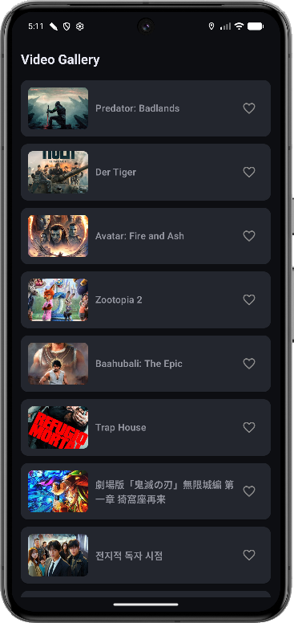
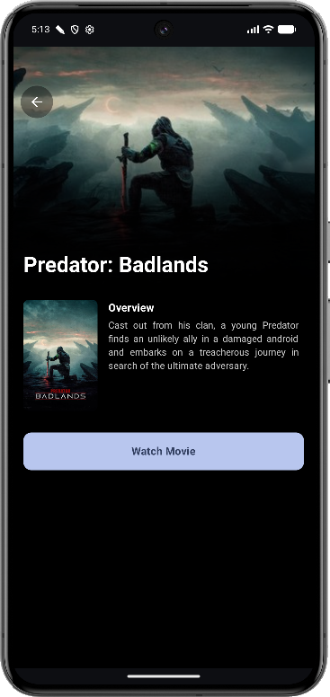
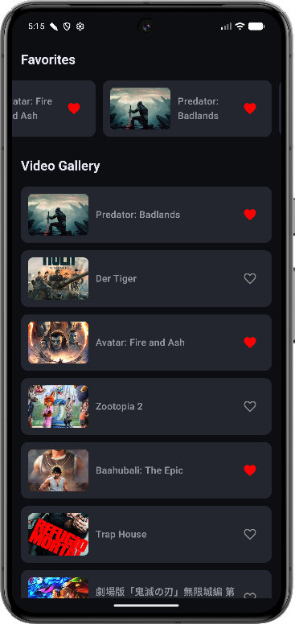

# 🎬 Video Gallery - Interview Demonstration

A premium, high-performance Android application built with **Modern Android Development (MAD)** practices. This project demonstrates advanced architectural patterns and UI/UX excellence, serving as a showcase of senior-level coding skills for interview review purposes.

---

## 📸 App Showcase

  
  
  

---

## 📝 Project Overview

This application provides a seamless video browsing experience, featuring a dynamic gallery, detailed cinematic views, and a local favorites management system. It's designed to be lightweight, responsive, and robust.

### Core Functionalities 🚀
- **Dynamic Video Gallery**: Real-time fetching of trending videos via Retrofit.
- **Cinematic Details**: Immersive detail screen with backdrop gradients and high-res posters.
- **Favorites System**: Add/Remove videos to a local database with real-time UI synchronization.
- **Smooth Animations**: Item animations for a premium feel when managing favorites.

---

## 🏗️ Architecture & Technical Stack

The project is architected to be highly scalable, maintainable, and testable.

### 🏛️ Clean Architecture
Separated into three distinct layers to ensure a clean separation of concerns:
- **Data**: Retrofit for API, Room for local persistence, and DataSources for abstraction.
- **Domain**: Pure Kotlin layer containing Repositories (interfaces) and Use Cases (business logic).
- **Presentation**: Jetpack Compose using the **MVI (Model-View-Intent)** pattern for a single source of truth and unidirectional data flow.

### 🛠️ Key Technologies
- **Jetpack Compose**: 100% declarative UI with Material 3 styling.
- **Dagger-Hilt**: Dependency injection for modularity and testability.
- **Room Database**: Local persistence for offline favorites management.
- **Retrofit & OkHttp**: Robust networking with JSON serialization.
- **Kotlin Coroutines & Flow**: Asynchronous programming and reactive data streams.
- **Coil**: Efficient image loading and caching.

### 🧪 Quality Assurance
- **Unit Testing**: Strategic testing using **JUnit 5**, **MockK**, and **Turbine** (for Flow verification).
- **Clean Code**: SOLID principles, meaningful naming, and modular structure.

---

## 🚦 Getting Started

1.  **Clone the repository**.
2.  **Open in Android Studio** (Koala or newer recommended).
3.  **Sync Gradle** and ensure all dependencies are resolved.
4.  **Run on a Physical Device/Emulator** (API 24+).

---

## 👨‍💻 Developer's Note
This repository highlights my proficiency in building production-ready Android apps with a focus on code quality, design patterns, and performance. I look forward to discussing the design decisions behind this implementation.

---
*For demonstration purposes only.*
